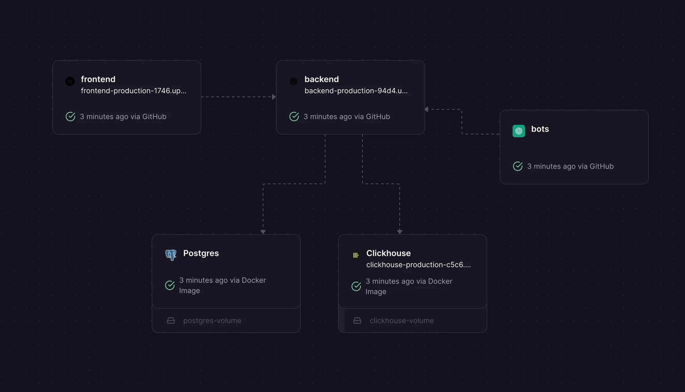
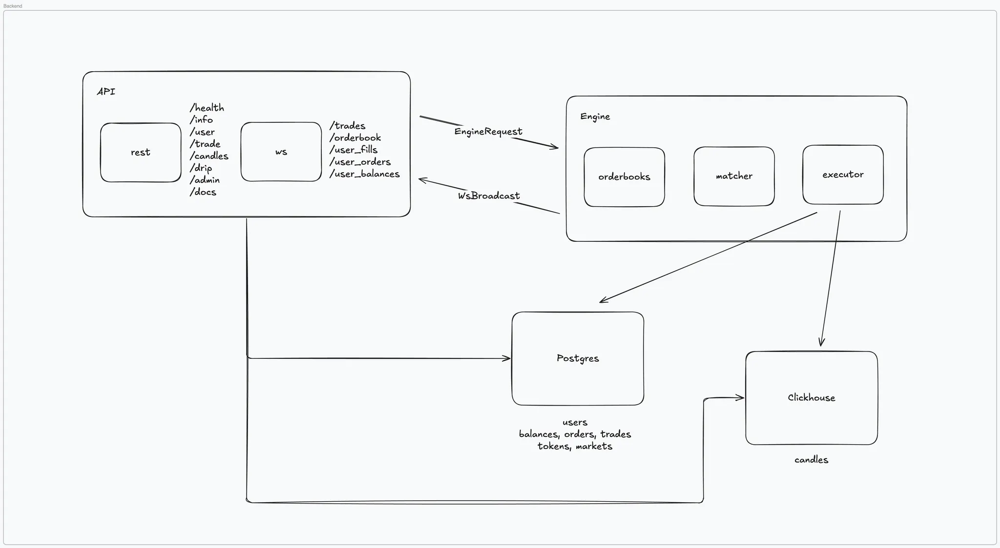
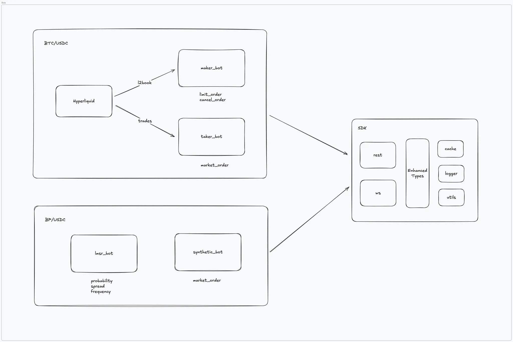

<div align="center">

A full terminal UI for trading an Aspens Market Stack.

</div>

## Project Structure

```
exchange/
├── apps/
│   ├── backend/              # Rust Axum API + matching engine
│   │   └── db/               # PostgreSQL + ClickHouse
│   ├── ui/             # Next.js trading interface
│   └── bots/                 # Market-making bots
├── packages/
│   ├── shared/               # Shared schemas (OpenAPI, WebSocket)
│   └── sdk/                  # Multi-language SDKs (TypeScript, Python, Rust)
└── docker-compose.yaml       # Infra
```

## Demo

One-click Railway deployment with live trading: authentication via Turnkey embedded wallet, real-time candle data after a few hours of market activity, and executing both market and limit orders.

https://github.com/user-attachments/assets/cd2c3132-4aea-4137-b724-6d2ecf1a536b

## Table of Contents

- [Getting Started](#-getting-started)
  - [Prerequisites](#prerequisites)
  - [Quick Start](#quick-start)
  - [Available Commands](#available-commands)
  - [Environment Configuration](#environment-configuration)
  - [API Documentation](#api-documentation)
- [Architecture](#-architecture)
  - [Exchange Overview](#exchange-overview)
  - [Backend](#backend)
    - [Matching Engine](#matching-engine)
    - [Database](#database)
    - [API](#api)
  - [ui](#ui)
  - [Bots](#bots)
  - [Testing & Deployment](#testing--deployment)
- [Improvements](#improvements)
- [License](#license)

## 🚀 Getting Started

### Prerequisites

- [Node.js](https://nodejs.org/) and [Bun](https://bun.sh/)
- [Docker](https://www.docker.com/) and Docker Compose
- [Just](https://github.com/casey/just)

### Quick Start

```bash
# Clone the repository
git clone git@github.com:aspensprotocol/terminal-ui.git
cd exchange

# Start everything with docker compose
docker compose up -d
```

### Start Services Individually

```bash
# Install dependencies
just install

# Start databases
just db

# Start the backend
just backend

# Start the ui
just ui

# Start market-making bots
just bots
```

Access the app at:

- ui: http://localhost:3000
- Backend: http://localhost:8888
- Swagger UI: http://localhost:8888/api/docs
- PostgreSQL: postgresql://localhost:5432
- ClickHouse: http://localhost:8123

## 🏗️ Architecture

### Exchange Overview



This exchange is built as a modern, full-featured trading system with the following components:

- **Backend**
  - **API**: REST and WebSocket APIs with multi-language SDK support
  - **Database**: Dual architecture with PostgreSQL (OLTP) and ClickHouse (OLAP)
  - **Matching Engine**: In-memory orderbook with price-time priority matching
- **ui**: Next.js application with TradingView integration and embedded wallet
- **Bots**: Automated market makers with external market integration
- **Testing & Deployment**: Containerized development and one-click deployment

---

### Backend



#### Matching Engine

The matching engine is the core of the exchange, handling order placement, matching, and execution.

- **Orderbook**: In-memory B-tree implementation with price-time priority, O(log n) complexity
- **Matcher**: Price-time priority algorithm with continuous matching and partial fills
- **Executor**: Atomic trade execution with balance locking and transaction rollback

#### Database

The exchange uses a dual-database architecture optimized for different workloads:

- **ClickHouse (OLAP)**: Materialized views for real-time candlestick aggregation and time-series analytics
- **PostgreSQL (OLTP)**: Primary transactional database storing users, tokens, markets, orders, balances, and trades

#### API

- **REST & WebSocket**: OpenAPI-documented REST endpoints and real-time WebSocket subscriptions powered by Tokio
- **Multi-language SDKs**: TypeScript, Python, and Rust clients auto-generated from OpenAPI and JSON Schema

---

### ui


Modern Next.js trading interface with professional features:

- **Zustand**: Lightweight state management with real-time WebSocket synchronization
- **TypeScript SDK**: Type-safe API client with WebSocket subscriptions
- **TradingView**: Advanced charting with custom drawing tools and real-time updates
- **Turnkey**: Embedded wallet with secure key management, no browser extension required
  - Note: When deploying, ensure `NEXT_PUBLIC_ORGANIZATION_ID` and `NEXT_PUBLIC_AUTH_PROXY_CONFIG_ID` are set as build-time environment variables

---

### Bots



Automated market-making bots to provide liquidity:

- **BTC/USDC**: Hyperliquid mirror bot that replicates order book depth with configurable risk parameters
- **BP/USDC**: LMSR (Logarithmic Market Scoring Rule) market maker with dynamic spread adjustment (planned)

---

### Testing & Deployment

- **Devcontainers**: Easily start dev enviornment with tools pre-installed
- **Testcontainers**: Integration testing with isolated database instances and automated cleanup
- **GitHub Actions**: Automated CI/CD pipeline for testing and deployment

## Improvements

Features and improvements to consider for production:

- perps
- pnl
- deposits / withdrawals
- helllaaa latency
- write ahead log lmao
- design for concurrency across multiple markets
- metrics & alerting
- backups & disaster recovery
- scaling / k8s
- mm channel prioritization
- cancel prioritization

## License

MIT
